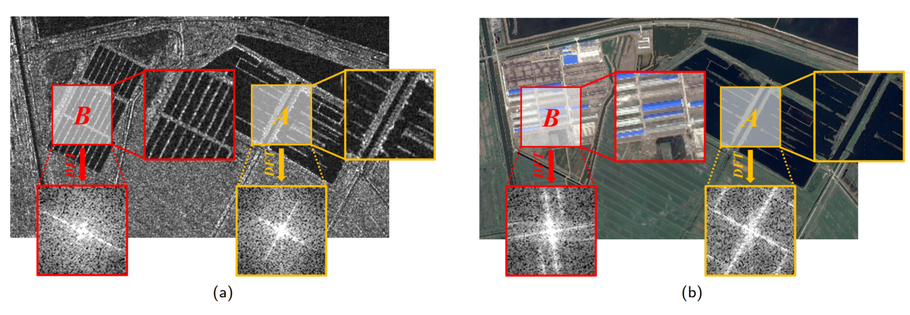

# FDMCD
Python Official Implementation of [Fourier domain structural relationship analysis for unsupervised multimodal change detection.](https://www.sciencedirect.com/science/article/pii/S092427162300062X)




## Abstract
Change detection on multimodal remote sensing images has become an increasingly interesting and challenging topic in the remote sensing community, which can play an essential role in time-sensitive applications, such as disaster response. However, the modal heterogeneity problem makes it difficult to compare the multimodal images directly. This paper proposes a Fourier domain structural relationship analysis framework for unsupervised multimodal change detection (FD-MCD), which exploits both modality-independent local and nonlocal structural relationships. Unlike most existing methods analyzing the structural relationship in the original domain of multimodal images, the three critical parts in the proposed framework are implemented on the (graph) Fourier domain. Firstly, a local frequency consistency metric calculated in the Fourier domain is proposed to determine the local structural difference. Then, the nonlocal structural relationship graphs are constructed for pre-change and post-change images. The two graphs are then transformed to the graph Fourier domain, and high-order vertex information is modeled for each vertex by graph spectral convolution, where the Chebyshev polynomial is applied as the transfer function to pass K-hop local neighborhood vertex information. The nonlocal structural difference map is obtained by comparing the filtered graph representations. Finally, an adaptive fusion method based on frequency-decoupling is designed to effectively fuse the local and nonlocal structural difference maps. Experiments conducted on five real datasets with different modality combinations and change events show the effectiveness of the proposed framework.

## Requirements

```
python==3.9.7
scikit-learn==0.18.3
imageio=2.9.0
numpy==1.20.3
gdal==3.0.2
opencv==4.5.5
```
## Citation
Please cite our paper if you use this code in your research.
```
@article{CHEN2023Fourier,
title = {Fourier domain structural relationship analysis for unsupervised multimodal change detection},
journal = {ISPRS Journal of Photogrammetry and Remote Sensing},
volume = {198},
pages = {99-114},
year = {2023},
issn = {0924-2716},
doi = {https://doi.org/10.1016/j.isprsjprs.2023.03.004},
url = {https://www.sciencedirect.com/science/article/pii/S092427162300062X},
author = {Hongruixuan Chen and Naoto Yokoya and Marco Chini}
}
```

## Q & A
**For any questions, please [contact us.](mailto:Qschrx@gmail.com)**